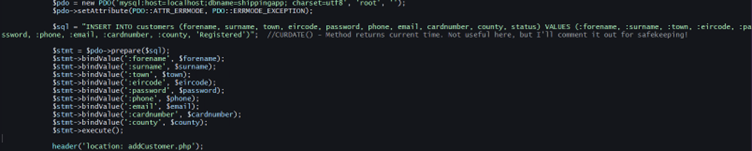
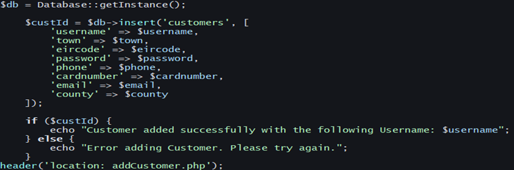
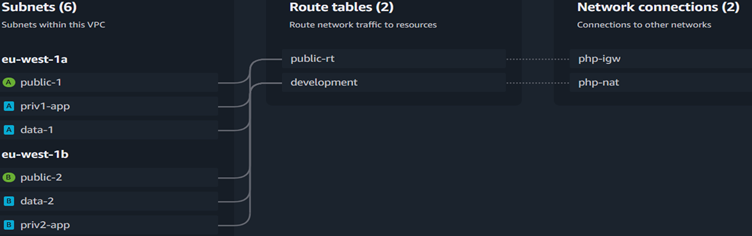
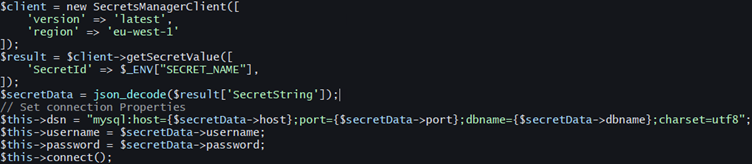
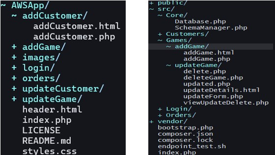
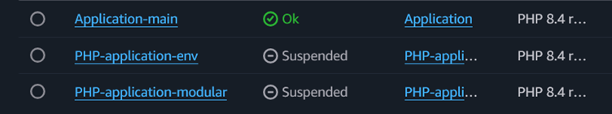

# PHP Original Server Side Project
This project was submitted by Daniel Jameson(T00158237) for a Server Side Scripting Module in college. It features a PHP/HTML/CSS project that deals with database and entity management. In this case, the application sells games to customers. 
When this project was submitted originally, the links didn't work properly, some logic needed to be changed and the directory structure was horrific, and needed complete refactoring.

So in Early February 2025, it was dusted off for an AWS project and had some TLC performed to it for migration to Cloud services instead of local running. Version control was installed and monitored from this date, and the app has come a long way since then.

## Updated AWS Project
This project was submitted in April 2025 for a Cloud Application Development module in the same course. This project now deploys to Amazon Web Services(AWS) via the Elastic Beanstalk
Service. The database was a MariaDB Database, and uses a custom made Virtual Private Cloud(VPC) to handle distribution. The environment was configured with load balanced instances
that provide redundancy in the case of a downed application. As of writing, this application can no longer be viewed online, although a full write-up can be viewed in the [DOCX File](/Daniel_Jameson_Cloud_Project.docx) accompanying this project. The application was eventually taken down to prevent incurring unecessary charges on the AWS platform.

## Objectives
* Research best practices for migrating a PHP application to the AWS platform.
* Research case studies and implementations of the "Strangler Fig Pattern".
> The Strangler Pattern incrementally replaces the legacy system by building a new system alongside the old one, eventually "strangling" the old system into a new system.
* Design a private API behind a gateway for testing and querying.
* Deploy the Application to the Elastic Beanstalk environment, using various methods, such as the AWS "EB" facility.
* Migrating data to the "RDS MariaDB" instance, and ensuring that the data is held in a secure place, and secrets refactored into another area.

## Completion Status
* Refactor Application: The database methods were much simplified from their original implementation through refactoring methods into their own database class complete with schema management.  
* Design a VPC for networking the application, load balancing and scaling. 
* AWS Gateway used to query and test the API. This is hidden behind a gateway, and should provide much more secure platform for testing, database manipulation etc.
* RDS database integration: Uses MariaDB again, and is much more secure, now using AWS Secrets Manager for credential management.

*This allows for implementing the secrets one time, instead of the old setup, which required the implementation of a database connection with credentials in every file where a database connection is necessary.*
* Application Refactoring: The application structure is more sane, keeping categories for all major entities. Login, Orders, etc.

* Addition of Elastic Beanstalk environments: The .ebextensions and .elasticbeanstalk folders now contain important environment variables for locating and setting up the EB environment.

^ The standard environment would not do this job, as the VPC is not correctly configured automatically, with EC2 instances being configured in the wrong subnets. These needed to be controlled for using a set of custom environment variables in the above mentioned folders.

## Future Iterations
* In the future, this application could be upgraded with Laravel being installed as a framework. This was not done here, as the prioritization of tasks needed for the strangulation pattern didn't allow for a full application rebuild, which would have been necessary for the introduction of a framework. This could be implemented into a separate app in the next iterations.
* Next time, get more screenshots, I think I had a folder of Screenshots, but deleted them at some point, as the project had a live demonstration, and I didn't think they would be necessary.